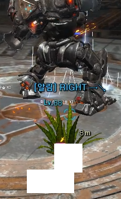
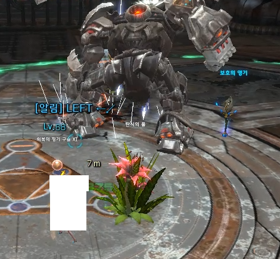
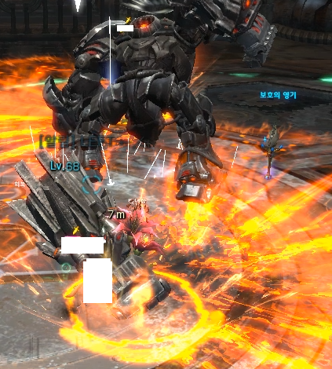
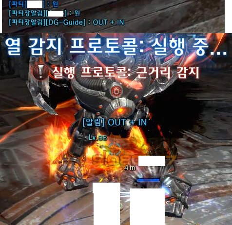

# RK9-Guide

(1st Dec 2017) 
- *Please download latest version for HM/EM for NA/EU servers as there is a change in packet defination
- *Please also update your tera data file to the latest from https://github.com/meishuu/tera-data

SCRIPT BY SHINOYX - For TERA
For private use only. Credits to teralove and soler91 for their VS guides

Call out attacks from RK-9 Bosses all 3 of them including both NORMAL MODE & HARD MODE & EXTREME MODE

Script automatically detects bosses and which dungeon hard or normal.

Please report any issues to me either here or on discord :)

# Commands 
Only usable in the RK9 Map. Using of commands outside map will return undefine command.
- !rk9 to toggle module (DEFAULT: ON)
- !party to toggle party notice (DEFAULT: SELF ONLY)
- !lastbosstoparty to toggle  IN OUT WAVE call outs (DEFAULT: OFF)
- !itemhelper to toggle item spawn on ground (DEFAULT: ON)
- !tank to toggle tank mode (Auto-enabled if you are LANCER or BRAWLER)
- !info to show all the above settings ON or OFF
- !help to show what commands are there in the RK9 guide module
- !debug FOR DEBUGGING PURPOSES

# Known issues
- All fixed as of 15th Nov

# Patch Notes
V1.00
- Created RK-9 Guide NORMAL MODE

V1.01 - 04
- Added RK-9 HARD MODE

V1.05
- Added more functionality checks to prevent errors

V1.06 - 08
- Fixed HARD MODE last boss call out <70% hp
- Fixed last boss multiple call outs
- Added S_QUEST_BALLOON Hook for HARD MODE
- Added Floor display (Flower) for safe zones

V1.09
- Added more codes to hardmode first boss pizza
- Fix hardmode last boss incorrect call outs
- Edit code to use Pinkie's command
- Deleted format.js due to usage of command
- Edit and shorten code length due to inefficient spawn item

V1.10
- Fixed normal mode first boss rocket jump call out
- Added last boss 97% call out
- Fixed hardmode last boss call outs on extrememode as well
- Added toggle function for item spawn
- Added function to call out only last boss in out wave mechs

# Future updates
- Open to suggestions

# Screenshots

